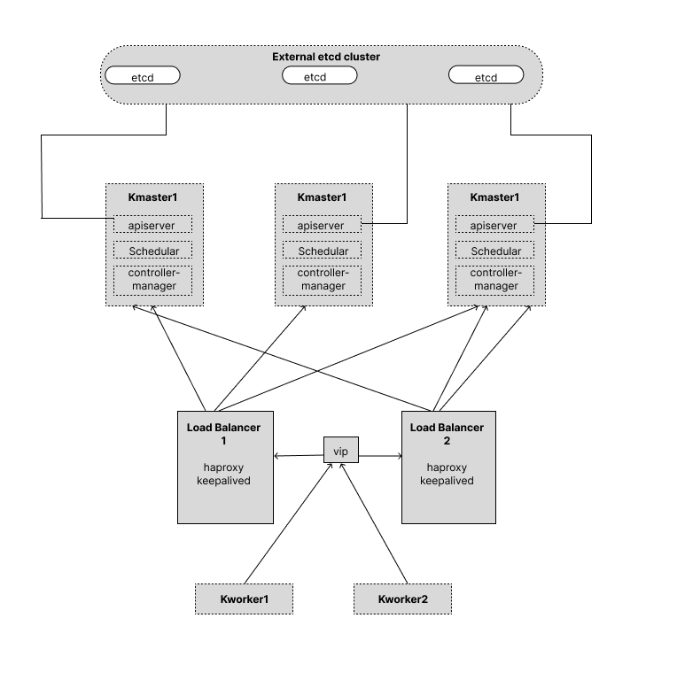
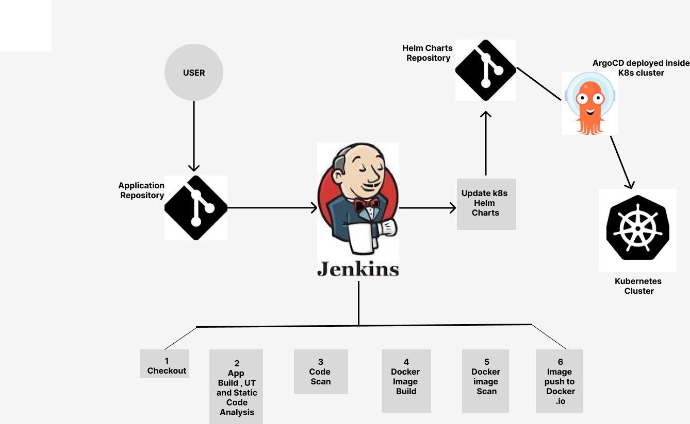

# Interintel Technologies DevOps Challenge - Nobella Nyarari Ejiofor

## Table of Contents
1. [Introduction](#introduction)
2. [Setting up a Highly Available K8s Cluster](#setting-up-a-highly-available-k8s-cluster)
3. [Setting up a big-data streaming data service](#setting-up-a-big-data-streaming-data-service)
4. [Setting up a CI/CD Pipeline](#setting-up-a-cicd-pipeline)
5. [My Articles](#my-articles)

# Introduction
I'm elated to take on this challenge as part of the interview process. All feedback and suggestions will be highly appreciated . 

# Setting up a Highly Available K8s Cluster
On Bare Metal.

### Base image configuration.
<u>On premises </u>
1. Use of a minimal operating system and a SCM (Security Configuration Management) ie Ansible to automate the process of applying security configurations to your base images .
2. Kubernetes labels on images to easen identification and management of images in the cluster.
3. Regular updates on the image pull policy and base images to ensure images are up to date. 
4. Scanning the image to get hold of any vulnerabilities before deploying to production.
5. Proper configuration of the underlying OS Configurations - ie network configuration, file permissions and user configurations .

<u>AWS</u>
1. Use of AWS Systems Manger parameter store - includes the parameters to configure security to the base image.
2. Use of least privilege on IAM to access of  images. 
3. AWS Manager State Manager Association - applies the parameters in the parameters group to the base image.
4. State manager association - applies security configuration to base image.
5. AWS Image buillder service can build new images from basic images.  
6. Deploying base images to AWS. 

### Load balancing 
On both load balancers(two different servers or using static ports on the master nodes ): update the system, and install Haproxy and Keepalived on both. In a round-robin load-balancing technique. On both load balancers : 

<u>Haproxy .</u>

Creating a script to check if there is a connection to the master nodes from the load balancer. 
Configuration of network interfaces - adding the virtual IP to the load balancers Network interfaces ie (eth1).
Configure the check script as in my [ckeck_apiserver.sh](./keepalived/check_apiserver.sh).

<u>In Haproxy.</u>
Editing the Haproxy file to listen to port 6443 on the load balancers, using the round-robin technique, to balance traffic on the three master nodes by adding their hostnames and IP addresses. 
Restarting the Haproxy service. 

### Setting up K8s
Automation  using Ansible or manually with low task loads on each server by connecting to servers with ssh.
- Upgrades, disabling swap in the /etc/fstab and disabling the firewalls. 
- Setting the hostnames by updating host files to include all servers involved then  enabling and loading the kernel modules, add kernel settings.
- Installation of k8s using container runtime, hence installation of  the runtime (containerd). 
- Enabling the docker repository.
- Add k8s apt repository  then  Installation of kubeadm, kubectl and kubelet. 
- Initialising the  Kubernetes cluster.
     kubeadm init --control-plane-endpoint="{VIRTUAL_IP_ADDRESS}:6443" --upload-certs --apiserver-advertise-address={server/node-IP-address-master1} --pod-network-cidr={CIDR}
- Join our other master nodes also including --apiserver-advertise-address={server/node-IP-address-master2/3}.
- Joining the worker nodes to the master nodes without the API-server tags as they are worker nodes.     
- Installing the network interface ie using  the calico manifest for  Kubernetes API  manifests networking datastores, opening the file and updating pod classless inter-domain routing ie in CIDR edit to our pool of IPs. Run the command on the master node to install the calico plugin.
- Verify cluster installation and high availability ie by rebooting one load balancer and checking if the virtual IP address is attached to the alternate load balancer  ie using: IP a s, or a journalctl of Keepalived. 

### Monitoring setup for servers
Use of Zabbix monitoring. A separate server can be used as the Zabbix server. SNMP, and IPMI can send alerts to the Zabbix server without the need to deploy an agent. If need be, the Zabbix agent can be deployed on all the servers and the Zabbix server collects all the metrics on the servers in the cluster. Suppose more metrics are needed rather than the OS level. In that case, metrics from the BMC can be collected using external scripts ie  the Redfish plugin which collects metrics on the physical state of the server ie the temperature of the server.

### Centralized logging  with EFK
EFK - Elastic search, Fluentd and Kibana.
Elasticsearch - stores indexes and logs data.
Fluentd - Log collector that collects and forwards logs to Elasticsearch.
Kibana - A web interface to visualize and explore log data stored in Elasticsearch.

# Setting up a big-data streaming data service
Airflow would enter the picture to coordinate the whole data pipeline. This implies that the NiFi and Spark Streaming operations would be scheduled and managed by Airflow.
### The data pipeline
1. The data pipeline would be defined by the directed acyclic graph (DAG) that Airflow would produce. The NiFi and Spark Streaming operations, together with the dependencies between them, would be specified in the DAG.
2. The DAG would then be scheduled by Airflow to execute on a regular basis.
3. The NiFi and Spark Streaming workflows are started by Airflow when the DAG runs.
    NiFi Process:
    After obtaining information from transactional  databases A and  B, and analytical databases B and C, NiFi modifies and purges it before publishing it to Kafka topics  V and W , X and Y respectively.
    
    Spark Process:
    Applications for Spark streaming take in data from Kafka topics Vand W, X and Y, analyze it in real time, and then publish the findings back to topics P and Q, R and S repectively .
    
    Data from Kafka topics P, Q, R  and Scan then be consumed by downstream applications or systems for additional processing or reporting.
4. To make sure the NiFi and Spark Streaming workflows are operating properly, Airflow would keep an eye on them.
In the event that the pipeline fails, Airflow will attempt an unsuccessful
The data can then be stored into a data lake ie Amazon S3, or a warehouse ie Amazon Redshift and more insights and analytics can be derived. For example, using Amazon Athena and Amazon Quicksight to query and visualize data respectively. The data can also be stored in a NoSQL database and can be queried from there.

## Setting up a CI/CD Pipeline
### 1. How I would go about it 
Depending on the application code language and the target platform for the pipeline, technologies and procedures to be used can be analyzed. I would ensure the availability of an existing and updated application source code in a version control system ie Github or GitLab for the first step of my pipeline. 

### 2. Approach taken 
The use of containerization in the pipeline if k8s is our target platform.
Use of docker agents in Jenkins  as the worker nodes to save costs and workloads. 
Use of ArgoCD and Argo Image Adapter deployed as controllers on k8s cluster in line with efficient GitOps tools. 

### 3. Implementation of the approach.

  The structure of CI/CD pipeline 
   
  Version control system  - GitLab  
  Two Source code repositories - One for the  application source code and another one for the k8s helm charts  
  Target platform - Kubernetes  
  Orchestrator - Jenkins, has multiple plugins, open-source with community support and free to use  
  Application code - Java   
  Argo CD - Scalable, No-code and easy to use on UI, open source  

  
When a user makes a commit to the repository the web hook in Git triggers Jenkins. Jenkins caters for our Continuous Integration. Jenkins will essentially be in the root folder of the application as a JenkinsFile. Our continuous Integration  done by Jenkins has the following steps. The following steps can be set up as docker agents with readily available docker images for easier integration and cost optimisation.
  1. Checkout - Checkout all the code from the commit by a user where Jenkins will pull the latest changes using the webhook in GitLab.
  2. Build  and Unit Testing with Static Code Analysis -  Since the application is in Java, the Maven Integration Plugin  could aid in building the application and Static code analysis with linting. For the unit test, the JUnit plugin  could come in handy. 
  3. Code Scan - The code will be scanned for security reasons and security checks by running SonarQube Analysis. SonarQube as it is publicly hosted.
  4. Docker Image build - Creation of a docker image from the Dockerfile in the repository.
  5. Docker image scan -  Use of a docker agent with a scanning tool ie Clair, with access to the docker daemon. To verify if the image created has any vulnerabilities ie in the base image, binaries or packages.
  6. Docker Image push - The docker image can then be pushed to Docker.io after authenticating Jenkins with docker.io.  
These steps are written in the Jenkins pipeline using a declarative approach as is more flexible and collaboration-friendly.
The continuous delivery starts from the updated K8s helm charts which are pushed to the helm charts repository by Argo Image Updator. In our k8s cluster , Argo Image Adaptor and ARgoCD can be deployed as controllers. Argo Image Updator will listen to our container registry and if any  changes are made, it will update our helm charts repository. ArgoCD will listen for any changes in the Helm charts repository and push the changes to Kubernetes.

# My Articles
I love documenting new things I learn in the DevOps Tech Space.
Some of my articles :
     [AWS Security with ACLs and Security Groups](https://cool-tech.hashnode.dev/aws-security-groups-and-nacl-diving-into-the-depths-of-aws-security)
     [Docker Multi Stage Build](https://cool-tech.hashnode.dev/docker-multi-stage-build)

